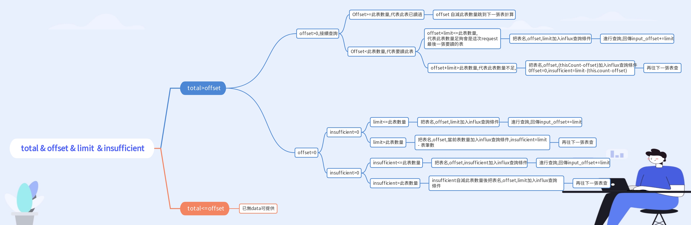

# api_response_limit_offset 

## request
* start_time & end_time is required with second.
* offset is optional. Default is 0.

## response
* Timestamp unit is millisecond, starting from January 1, 1970 UTC.
* The maximal number of return data is 2,500 in a single request. You can use same request condition but change offset to get remain data.
* If offset is equal to total that means it's the last data

